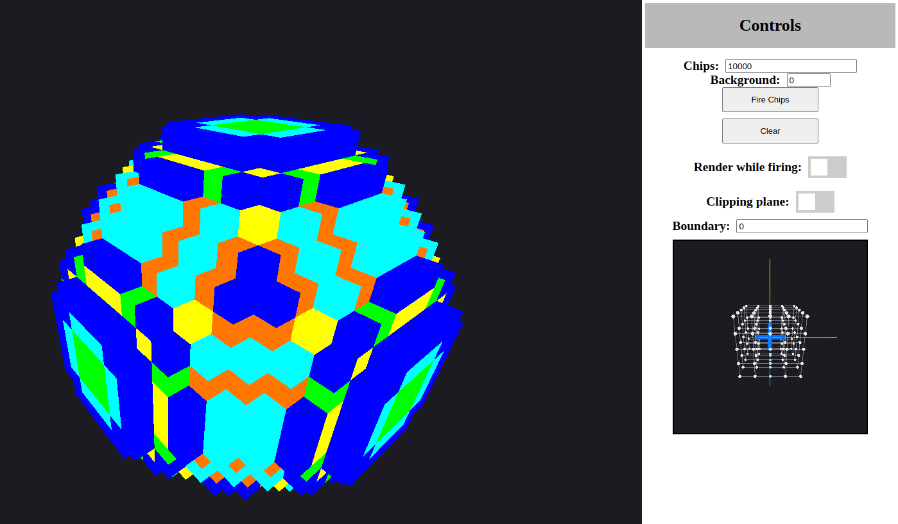

# 3D Chip-Firing

[](https://opensource.org/licenses/MIT)

This repository contains the code for the paper:
> Martin Skrodzki and Ulrich Reitebuch, "Chip-Firing Revisited: A Peek Into The Third Dimension", Proceedings of Bridges 2022: Mathematics, Art, Music, Architecture, Culture, [https://archive.bridgesmathart.org/2022/bridges2022-221.html](https://archive.bridgesmathart.org/2022/bridges2022-221.html).



If you use our code in your publications please consider citing:
```
@inproceedings{skrodzki2022Chip-Firing,
  author      = {Skrodzki, Martin and Reitebuch, Ulrich},
  title       = {Chip-Firing Revisited: A Peek into the Third Dimension},
  pages       = {221--228},
  booktitle   = {Proceedings of Bridges 2022: Mathematics, Art, Music, Architecture, Culture},
  year        = {2022},
  editor      = {Reimann, David and Norton, Douglas and Torrence, Eve},
  isbn        = {978-1-938664-42-7},
  issn        = {1099-6702},
  publisher   = {Tessellations Publishing},
  address     = {Phoenix, Arizona},
  url         = {http://archive.bridgesmathart.org/2022/bridges2022-221.html}
}
```
Whenever using this repository please also attribute the code to Robert Kirsten-Cumming and Martin Skrodzki.

Find the published version of the paper [here](https://archive.bridgesmathart.org/2022/bridges2022-221.html).

## License and third-party software
The source code in this repository is released under the MIT License. However, all third-party software libraries that are used are governed by their respective licenses. Without the following libraries, this project would have been considerably harder: 
[three.js](https://threejs.org/)
[math.js](https://mathjs.org/)
[node.js](https://nodejs.org/en)
